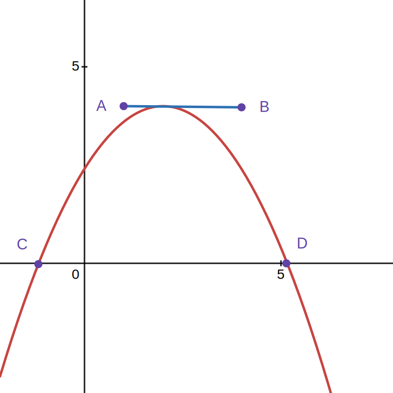

## 函数顶点在线段上移动
### Question
A(1, 4) B(4, 4)  
抛物线 $`y=a(x-m)^2+n`$ 的顶点在线段 AB 上运动  
抛物线与 x 轴交于 C, D 两点（C 在 D 左侧）  
点 C 的横坐标最小值为 $`-3`$，则 D 的最大值为 ___  
  
[图形desmos地址](https://www.desmos.com/geometry/zkbseykswo)  
### Answer
点 C 的横坐标最小时，抛物线顶点在 A 上  
由于二次函数具有**对称性**，此时对称轴为直线 x = 1，又因为 C 横坐标为 -3，所以此时 D 的横坐标为 5.  
因为 AB = 3，所以 D 的最大值为 $`5+3=8`$.